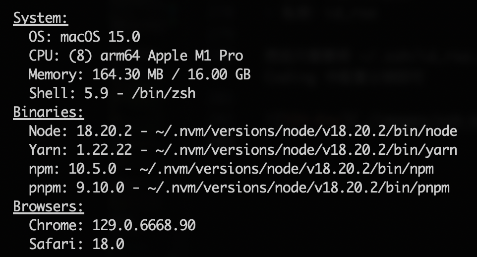
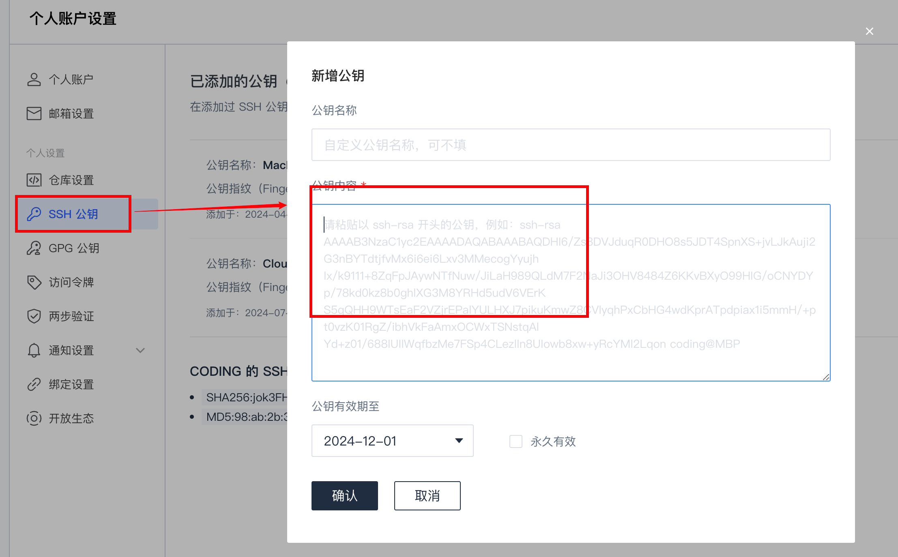

# 前端开发环境搭建 - macOS

> `Windows` 操作系统请看 [前端开发环境搭建 - Windows](./setup-windows.md)

macOS 是一个类 UNIX 系统，就像 Ubuntu 可以用 `apt-get`，CentOS 可以用 `yum` 等软件包管理工具来下载安装软件依赖，macOS 可以用 `brew` 来非常方便的下载开发所需的各种依赖。所以我们开始的第一步就是要安装 [HomeBrew](https://brew.sh/)，同时拥有一个舒服的 Shell 环境。

:::tip 提示
由于种种原因，在中国大陆访问 Github 等国外站点会比较不稳定，为了确保后面的流程顺利进行，你应该先尝试建立好**科学上网 🪜**的环境。
:::

[[TOC]]

## 1. 使用 `Oh-My-Zsh`

- Oh My Zsh 是一款社区驱动的命令行工具，它基于 zsh 命令行，提供了主题配置，插件机制，以及内置的便捷操作。
- Oh My Zsh 是基于 zsh 命令行的一个扩展工具集，提供了丰富的扩展功能。
- 安装 Oh My Zsh 前提条件：必须已安装 zsh

### 1.1 指定 `zsh` 为默认 shell

幸运的是，macOS 内置了 `zsh`，但是默认 Shell 环境还是 Bash，所以需要指定 `zsh` 为默认 shell。

```bash
chsh -s /bin/zsh
```

### 1.2 安装 `Oh-My-Zsh`

```bash
sh -c "$(curl --insecure -fsSL https://raw.github.com/ohmyzsh/ohmyzsh/master/tools/install.sh)"
```

也可以用国内镜像：

```bash
sh -c "$(curl --insecure -fsSL https://gitee.com/mirrors/oh-my-zsh/raw/master/tools/install.sh)"
```

### 1.3 更改 `Oh-My-Zsh` 主题

所有的主题列表在这：https://github.com/ohmyzsh/ohmyzsh/wiki/Themes

推荐大家使用默认的 `robbyrussell` 主题：

```bash
vim ~/.zshrc
# 在打开的文本编辑器中找到 ZSH_THEME 就是指定主题的位置。
ZSH_THEME="robbyrussell"
```

:::tip vim 的基本使用

- 在预览模式下按 `i` 进入编辑模式；
- 在编辑模式按 `esc` 退出编辑模式；
- 退出编辑模式后，在**英文输入法**下按 `Shift` + 连按两次 `Z` 即保存并退出。

:::

保存修改并退出后，执行 `source ~/.zshrc` 即可使修改后的配置生效。

### 1.4 安装并使用 oh-my-zsh 插件

oh-my-zsh 因为有丰富的插件所以非常好用，打开 ~/.zshrc 找到 `plugins=(...)` 配置项，即为插件配置。这个配置里只需要将插件名列进去即为启用插件，比如：

```bash
plugins=(git zsh-autosuggestions zsh-syntax-highlighting z extract web-search)
```

但是其中有些插件并不是 oh-my-zsh 内置的，所以需要我们进行下载：

1. zsh-autosuggestions

   命令行自动提示插件

   ```bash
   git clone https://github.com/zsh-users/zsh-autosuggestions ${ZSH_CUSTOM:-\~/.oh-my-zsh/custom}/plugins/zsh-autosuggestions
   ```

2. zsh-syntax-highlighting

   命令行语法高亮插件

   ```bash
   git clone https://github.com/zsh-users/zsh-syntax-highlighting.git ${ZSH_CUSTOM:-\~/.oh-my-zsh/custom}/plugins/zsh-syntax-highlighting
   ```


3. 已经集成了的插件，直接开启即可

   - extract：无论什么压缩包，直接 `x filename` 即可解压（不用去记 tar 命令奇怪的参数含义了）
   - z：会记忆你进入过的目录，相当于增强版 cd
   - git：人如其名
   - web-search：直接在命令行中进行 Google / Baidu / Bing 搜索，比如 `google 华南师范大学`

下载后，在 ~/.zshrc 中的 `plugins=(...)` 添加配置：

```bash
plugins=(git zsh-autosuggestions zsh-syntax-highlighting z extract web-search)
```

保存退出后，`source ~/.zshrc` 即可使修改后的配置生效。


## 2. 安装 HomeBrew

### 2.1 下载 Homebrew

```bash
/bin/bash -c "$(curl -fsSL https://raw.githubusercontent.com/Homebrew/install/HEAD/install.sh)"
```

### 2.2 换源

默认的国外源速度堪忧，让我们换成国内源。

换源需要将 `brew.git`、`homebrew-core.git` 和 `homebrew-cask.git` 的源都换了：

1. 查看当前源

```bash
# 查看 brew.git 当前源
cd "$(brew --repo)" && git remote -v
```

2. 修改为清华源

```bash
# 修改 brew.git
git -C "$(brew --repo)" remote set-url origin https://mirrors.tuna.tsinghua.edu.cn/git/homebrew/brew.git
```

### 2.3 替换 brew bintray 源

:::tip 提示
请确保已经根据[上面](#1-使用-oh-my-zsh)将 `zsh` 设置为默认 shell
:::

打开 `~/.zshrc`

```bash
vim ~/.zshrc
```

在后面添加：

```bash
export HOMEBREW_PIP_INDEX_URL=https://pypi.tuna.tsinghua.edu.cn/simple
export HOMEBREW_API_DOMAIN=https://mirrors.tuna.tsinghua.edu.cn/homebrew-bottles/api
export HOMEBREW_BOTTLE_DOMAIN=https://mirrors.tuna.tsinghua.edu.cn/homebrew-bottles/
eval $(/opt/homebrew/bin/brew shellenv)
```

保存并退出后，应用配置更改：

```bash
source ~/.zshrc
```

## 3. 让 Finder 默认显示隐藏文件

在不做任何配置的情况下，macOS 的 Finder 是默认不显示隐藏的文件和文件夹的（比如 `.git` | `~/.npmrc` | `~/.ssh`）这对开发者来说比较不好，我们只需要执行下面的命令即可让 Finder 默认显示这些隐藏文件/文件夹。

```bash
defaults write com.apple.finder AppleShowAllFiles -boolean true ; killall Finder
```

## 4. 安装 SDK 和 IDE

总的来说，有这些：

- VSCode
- iterm2
- git
- nvm
- cmake
- ninja
- 微信开发者工具
- 谷歌浏览器
- [可选] snipaste（截图工具）

有了 Homebrew，安装这些非常简单

```bash
brew install git nvm cmake ninja
brew install --cask visual-studio-code wechatwebdevtools google-chrome snipaste iterm2
```

### 4.1 nvm 配置

`nvm` 需要在 `~/.zshrc` 中加上一些变量配置：

```bash
vim ~/.zshrc
# 在打开的文本中添加
export NVM_DIR="$HOME/.nvm"
  [ -s "/opt/homebrew/opt/nvm/nvm.sh" ] && \. "/opt/homebrew/opt/nvm/nvm.sh"  # This loads nvm
  [ -s "/opt/homebrew/opt/nvm/etc/bash_completion.d/nvm" ] && \. "/opt/homebrew/opt/nvm/etc/bash_completion.d/nvm"  # This loads nvm bash_completion
export NVM_NODEJS_ORG_MIRROR=http://nodejs.org/dist
```

保存并退出后，应用配置变更

```bash
source ~/.zshrc
```

### 4.2 vim 配置

不做任何配置的 vim 用起来比较麻烦，可以通过配置 ~/.vimrc 来增强 vim

```bash
vim ~/.vimrc
```

在打开的编辑器粘贴以下配置

```vim
"显示行号，下面这行取消注释就会开启行号显示
"set nu

"启动时隐去援助提示
set shortmess=atI

"语法高亮
syntax on

"使用vim的键盘模式
set nocompatible

"不需要备份
set nobackup

"没有保存或文件只读时弹出确认
set confirm

"鼠标可用
set mouse=a

"tab缩进
set tabstop=4
set shiftwidth=4
set expandtab
set smarttab

"文件自动检测外部更改
set autoread

"c文件自动缩进
set cindent

"自动对齐
set autoindent

"智能缩进
set smartindent

"高亮查找匹配
set hlsearch

"显示匹配
set showmatch

"显示标尺，就是在右下角显示光标位置
set ruler

"去除vi的一致性
set nocompatible

"设置键盘映射，通过空格设置折叠
nnoremap <space> @=((foldclosed(line('.')<0)?'zc':'zo'))<CR>
""""""""""""""""""""""""""""""""""""""""""""""
"不要闪烁
set novisualbell

"启动显示状态行
set laststatus=2

"浅色显示当前行
autocmd InsertLeave * se nocul

"用浅色高亮当前行
autocmd InsertEnter * se cul

"显示输入的命令
set showcmd

"被分割窗口之间显示空白
set fillchars=vert:/
set fillchars=stl:/
set fillchars=stlnc:/

" vundle 环境设置
filetype off
set rtp+=~/.vim/bundle/Vundle.vim
" vundle 管理的插件列表必须位于 vundle#begin() 和 vundle#end() 之间
"call vundle#begin()
"Plugin 'VundleVim/Vundle.vim'
" 插件列表结束
"call vundle#end()
filetype plugin indent on

" 配色方案
"set background=dark
"colorscheme solarized
"colorscheme molokai
"colorscheme phd

" 禁止显示菜单和工具条
set guioptions-=m
set guioptions-=T

" 总是显示状态栏
set laststatus=2

" 禁止折行
set nowrap

" 设置状态栏主题风格
let g:Powerline_colorscheme='solarized256'

syntax keyword cppSTLtype initializer_list

" 基于缩进或语法进行代码折叠
"set foldmethod=indent
set foldmethod=syntax
" 启动 vim 时关闭折叠代码
set nofoldenable

"允许用退格键删除字符
set backspace=indent,eol,start

"编码设置
set encoding=utf-8

"共享剪切板
set clipboard=unnamed
```

保存并退出即可。


## 5. `Node.js` 和全局 npm 包

使用刚才安装的 nvm 来安装 `Node.js`

以下是一些常用的 nvm 指令

```bash
nvm list                 ##是查找本电脑上所有的node版本
    - nvm list     ##查看已经安装的版本
    - nvm list installed ##查看已经安装的版本
    - nvm list available ##查看网络可以安装的版本

nvm install    ##安装指定版本node
nvm uninstall  ##卸载制定的版本
nvm install stable             ## 安装最新稳定版 node，当前是node v9.5.0 (npm v5.6.0)
nvm install      ##安装指定版本，可模糊安装，如：安装v4.4.0，既可nvm install v4.4.0，又可nvm install 4.4

nvm use              ##切换使用指定的版本node
nvm -v                                     ##查看当前的版本

nvm ls                                     ## 列出所有安装的版本
nvm ls-remote                     ## 列出所有远程服务器的版本（官方node version list）
nvm current                          ## 显示当前的版本

nvm alias       ## 给不同的版本号添加别名
nvm unalias                      ## 删除已定义的别名

nvm use [version] [arch] ##切换制定的node版本和位数
```

### 5.1 安装 `Node.js`

对于综测项目来说，只需要安装 `Node.js v20` 即可

```bash
# 下载 v20.x 版本
nvm install 20
# 将 v20.x 版本作为默认的 Node.js 版本
nvm alias default 20
```

安装成功后，可以查看当前的 `Node.js` 版本

```bash
node -v
npm -v
```

### 5.2 npm 换源

npm 默认源 `https://registry.npmjs.org` 在大陆访问速度较慢，可以换成国内的其他 CDN 源。

下面挑一个你喜欢的源来换

```bash
# 淘宝源
npm config set registry https://registry.npmmirror.com/
# 腾讯源
npm config set registry https://mirrors.tencent.com/npm/
# 换回官方默认源
npm config set registry https://registry.npmjs.org/
```

### 5.3 安装 npm 全局包

总的来说有这些全局包要安装：

- pnpm：包管理器
- whistle：代理和抓包工具
- envinfo：查看当前环境

```bash
npm install -g pnpm whistle envinfo
```

验证安装：

```bash
pnpm -v
w2 --version
envinfo --system --binaries --browsers
```

最后一行命令（`envinfo --system --binaries --browsers`）用于查看当前开发环境



## 6. Git 配置

在开始和团队其他同学协作前，需要先对本地的 Git 进行一些配置。

### 6.1 基础信息配置

```bash
# 设置用户名
git config --global user.name 你的Github/其他托管平台用户名
# 设置邮箱
git config --global user.email 你的Github/其他托管平台注册邮箱
```

### 6.2 SSH Key

:::info 信息
如果你已经配置过公私钥对，则可以忽略这一步
:::

无论是在 Github 还是 Coding 上进行代码协作，都需要在本机生成公私钥，然后在代码远程仓库中配置公钥。

下面介绍生成 RSA 公私钥对的方法，只需执行（将 mail@example.com 换成你注册 Github / Coding 用的邮箱）：

```bash
ssh-keygen -t rsa -C mail@example.com # 将 mail@example.com 换成你注册 Github/Coding 用的邮箱
```

一路回车，就可以在 `~/.ssh/` 下看到公私钥对：

- 公钥：id_rsa.pub
- 私钥：id_rsa

然后只需要将 ~/.ssh/id_rsa.pub 中的内容复制到 Github/Coding 中配置公钥即可



## 小结

经过配置后，开发环境应该已经具备了下面的条件：

- VSCode，配置详见 [VSCode：100 倍研效提升](../devops/vscode.md)
- git，并做好了相关配置
- Node.js：通过 `nvm-windows` 管理
- 全局 npm 包：`pnpm`, `whistle`, `envinfo`
