# HTTP 代理和抓包

[[TOC]]

## 1. Web 世界的 HTTP

在前后端分离的项目架构中，前端通过 `ajax` 等方法来与后台 API 进行通信，这个过程的本质就是 **HTTP 通信**。

对于浏览器或者操作系统来说，Web 应用或小程序的本质就是，向(静态资源)服务器请求静态文件（比如 `.html`, `.js`, `.css` 等文件），然后按不同的规则解析/执行他们。这个请求静态资源的过程是借助 **HTTP 协议**完成的。

在 Web 应用或小程序运行的过程中，可以由 JavaScript 触发 `AJAX`（Asynchronous JavaScript and XML） 请求，在浏览器层面，一般有两种实现方式：

- [XMLHttpRequest](https://developer.mozilla.org/zh-CN/docs/Web/API/XMLHttpRequest)
- [Fetch API](https://developer.mozilla.org/zh-CN/docs/Web/API/Window/fetch)

开发同学熟悉的 `axios` 就是基于上面这两个底层 API 封装的。

然而无论是 `XMLHttpRequest` 还是 `fetch`，他们发起网络请求 / 获取响应也是借助 **HTTP 协议**完成的

甚至于，类似 `WebSocket` 这样的网络协议，本质上也是借助 **HTTP 协议**完成的

综上，HTTP 协议承载了 Web 世界（特别是前后端数据交互之间）绝大部分通信手段。

:::tip 提示
本文档不讨论 HTTP 八股，而是分享一种较为简单和通用的方法，来实现 HTTP 包的**抓取 / 重放**，帮助我们在前后端联调的过程中，更好的定位 / 分析问题。
:::

## 2. 代理和抓包

HTTP 通信中，每次请求 / 响应都是一个个 HTTP 数据包，如果我们可以抓取并拆开这些数据包，就可以非常清晰的看到请求头 / 响应头以及数据包的具体内容。

我们在这里先用直白的话对不同的数据包做一个简单的定义：

- 发包：由前端发出的 HTTP 请求包（比如用 ajax 发起的 HTTP 请求）
- 回包：后台收到前端发出的 HTTP 请求包后，执行某些操作最后返回的 HTTP 响应包

一次 HTTP 通信非常简单：

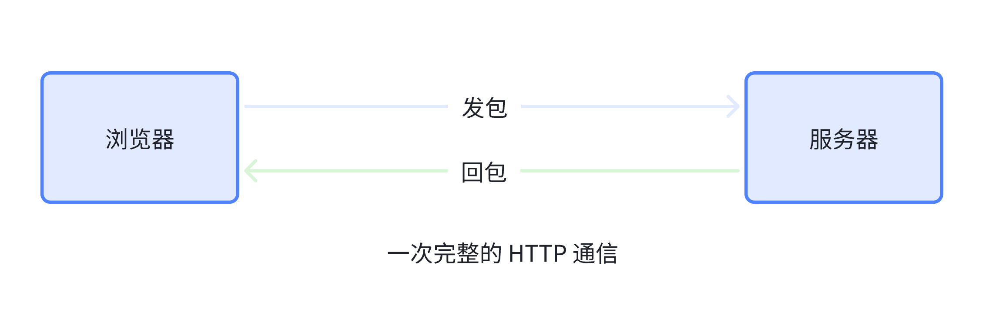

将 HTTP 通信中的双方想像成信件通信的两个人，A 写信给 B，B 看完信再回信给 A，信件由邮递员在 A 和 B 之间传递。

然而有一天，作为第三者的 C，很好奇 A 和 B 之间到底在交流什么，于是假装成邮递员，从 A 手里拿到信，拆开看完又装回去，再送到正常的邮递员手里；B 回信后，邮件也会先到 C 手里，C 拆开看完又装回去，再把信交给 A。

在整个过程中， A 和 B 都以为双方是直接通信的，没有感知到他们中间还有一个默默窥屏的 C。而这个 C 就是我们常说的“中间人”，也就是**代理服务器**，而 C 拦截通信双方之间的信件的这种行为，就是**抓包**

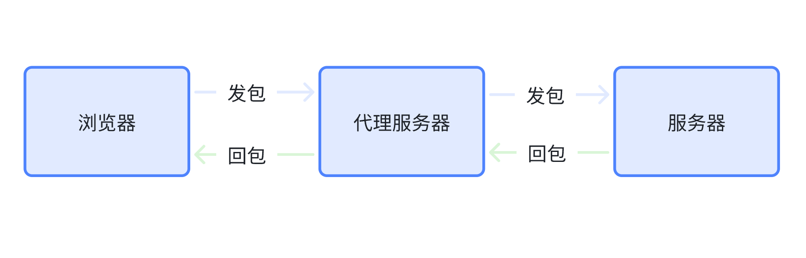

有了这个“中间人”，其实我们可以做一些更具想像力的事情，比如：**将客户端原本要发给服务端的信件发给中间人自己的服务端**，如图：
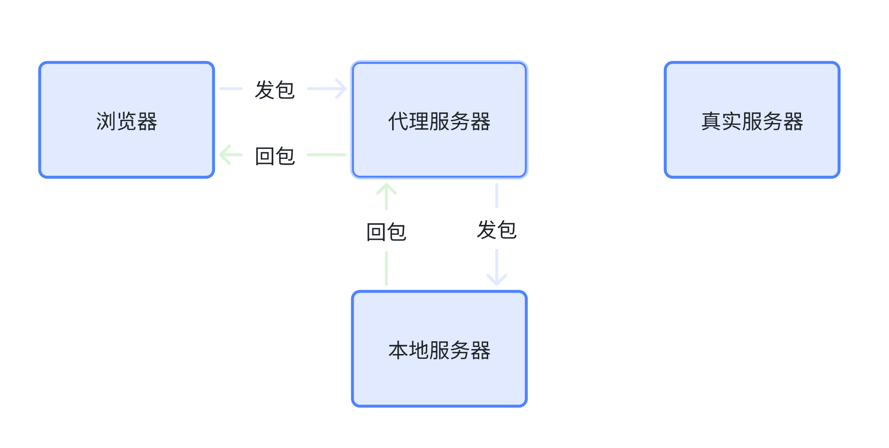

:::info 信息
这样一看，HTTP 特别不安全，很容易就会有这种“中间人”窃听到通信双方的数据。

确实，于是 HTTPS 站了出来，有效地防范了中间人攻击，不过关于 HTTPS 的细节这里就不展开了。
:::

实际上，我相信大部分同学已经有过“抓包”的经历了。当我们在浏览器用 `F12` 打开开发者工具，然后找到 `网络` 面板，就可以看到不同发包 / 回包的具体内容。

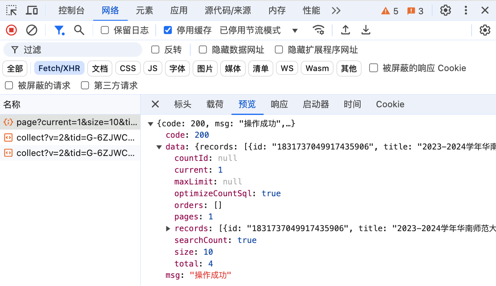

当然，这只是最最基础的抓包手段，作为 niubility 的前后端开发同学，我们需要一种通用手段来实现下面的目标：

- 任意的代理规则配置（比如上面设想的将请求代理到本地服务器）
- 强大的抓包解析能力（全方位解读 HTTP 数据包）
- 支持 HTTP2、HTTPS、WebSocket 的代理和抓包

下面我们介绍一种能够实现这些目标的开源 HTTP 代理工具：`whistle`

## 3. Whistle

基于 `Node.js` 实现的跨平台 Web 调试代理工具，首先贴一下一些官方链接：

- [Github](https://github.com/avwo/whistle)
- [使用文档](https://wproxy.org/whistle/)

它的安装方法见：

- [Windows](../frontend/setup-windows.md#_2-4-安装-npm-全局包)
- [macOS](../frontend/setup-macos.md#_5-3-安装-npm-全局包)

验证是否已经安装

```bash
w2 --version
```

### 3.1 启停代理服务器

```bash
# 开启 whistle
w2 start
# 关闭 whistle
w2 stop
```

开启后，默认情况下 whistle 会在 `http://127.0.0.1:8899/` 运行一个代理服务器，此时无论是浏览器还是其他 APP 发出的 HTTP 请求，**还没有**走过这个代理服务器，所以我们需要针对希望走代理服务器的 APP 进行单独设置，又或者采用最简单粗暴的方法：**设置全局代理**

### 3.2 全局代理

```bash
# 开启全局代理
w2 proxy
# 关闭全局代理
w2 proxy off
```

开启全局代理后，所有的程序发起的 HTTP 请求都会经过 whistle 代理服务器，也就是**所有的流量都会被代理**，无论是 `Chrome` 访问网页，还是微信产生的 HTTP 流量，都会流经代理服务器。

### 3.3 局部代理

比如我们在开发微信小程序时，只希望微信开发者工具发出的 HTTP 请求经过 whistle 代理，那么我们不设置全局代理，而是在微信开发者工具上进行配置。

> 微信开发者工具 > 设置 > 通用设置 > 代理 > 手动设置代理

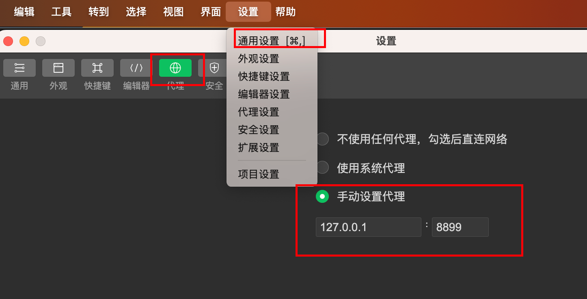

对于 Chrome 或者 Edge 浏览器，可以通过安装 [SwitchyOmega](https://chrome.google.com/webstore/detail/padekgcemlokbadohgkifijomclgjgif) 插件来做到局部代理


### 3.4 移动设备代理

上面无论是全局代理还是局部代理，都是针对开启 whistle 服务器的 PC 设备来说的，通过一些配置，我们可以让移动设备（Android / iOS）的 HTTP 流量也都流经 PC 设备的 whistle 代理服务器。

1. 确保开启 whistle 代理服务器的 PC 设备和移动设备处在**同一局域网下**
2. 找到 PC 设备在局域网下的 IPv4 地址

   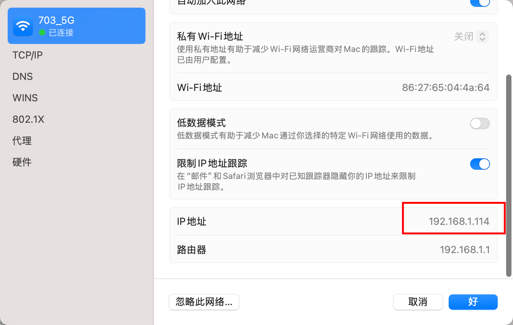

3. 移动设备设置代理服务器

   代理服务器地址填入开启了 whistle 代理的 PC 设备 IPv4 地址，默认情况下，whistle 代理运行在端口 `8899`
   <div :class="$style.row">
     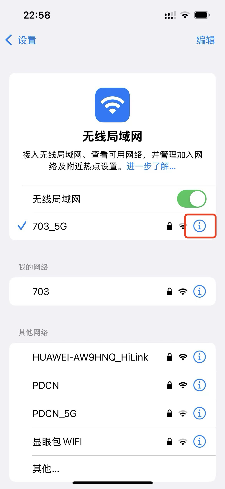
     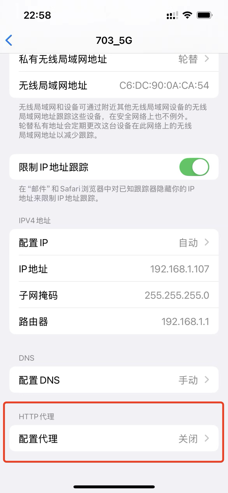
     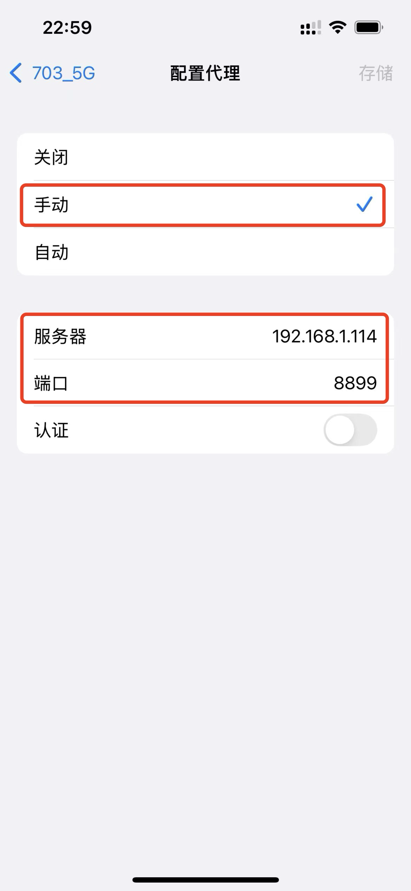
   </div>

保存并退出后，移动设备相当于开了个**全局代理**，所有 APP 发出的 HTTP 流量都会流经 PC 设备的 whistle 代理服务器，也就是说，可以在 PC 设备上抓取、重放移动设备发出的 HTTP 包。

### 3.5 配置代理规则

当你使用 `w2 start` 开启 whistle 代理服务器后，通过浏览器访问 `http://127.0.0.1:8899/` 即可进行配置代理规则、查看抓包、开启/停用 whistle 插件等等操作。

让我们创建一个新的规则集来配置一些代理规则。

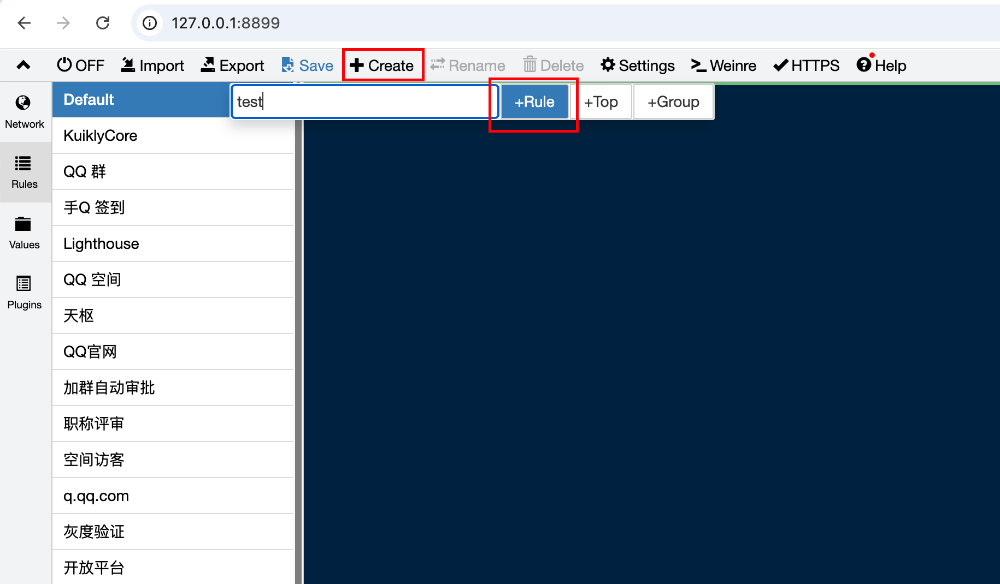

双击新增的规则集，看到规则集名称右边有 ✅ 的标识，即代表规则集**正在生效**。

常用的配置规则可以参考 [Whistle 官方手册](https://wproxy.org/whistle/frequet.html)，下面以一个简单的配置为例来说明。

```bash
line`
cszc.scnu.edu.cn
127.0.0.1:82
excludeFilter:///api/doSomething
whistle.inspect://vConsole
resCors://*
`
```

这个配置的含义是：

将所有请求 `cszc.scnu.edu.cn` 的数据包（无论 HTTP 还是 HTTPS）代理到 `http://127.0.0.1:82`，但是发往 `cszc.scnu.edu.cn/api/doSomething` 的数据包还是发到它原本应该发到的服务器。与此同时，启用名为 `vConsole` 的 whistle 插件，并且在所有回包中注入**跨域控制响应头**

- `` line`多行内容` ``：意为 `line` 包裹了多行内容，这些多行内容删除之间的 `\n` 后，可以视为单行配置。多用于当一行配置过长时进行拆分，也就是说，上面的配置等价于：

  ```bash
  cszc.scnu.edu.cn 127.0.0.1:82 excludeFilter:///api/doSomething whistle.inspect://vConsole
  ```

- cszc.scnu.edu.cn 是一条配置规则的最开始，他是一个 `host`，也就是域名，指示了要代理的目标。同时，他也支持正则匹配，比如：

  - `*.scnu.edu.cn`：匹配所有结尾是 `.scnu.edu.cn` 的域名，比如 `sso.scnu.edu.cn`
  - `*` 匹配所有域名

  也可以加上协议头，比如：

  - `https://baidu.com`：只代理 HTTPS 访问 `baidu.com` 的流量，不管其他的（包括 HTTP）
  - `ws://baidu.com`：只代理 `ws` 协议访问 `baidu.com` 的流量，不管其他的

- `127.0.0.1:82` 是规则的第二部分，它是**可选的**，是代理后的目标地址，如果你想让访问 `cszc.scnu.edu.cn` 的流量全都转到 `www.baidu.com`，那么你也可以这么配置：

  ```bash
  cszc.scnu.edu.cn www.baidu.com
  ```

  虽然这并没有什么实际意义。

- 第三个参数开始也都是可选的，是为这条代理规则附加上一些过滤器、插件等等，比如 `excludeFilter` 可以让某些地址不受该代理规则的影响（也就是不走代理），`whistle.inspect://` 可以启用某些插件，`resCors://*` 可以在响应包**注入跨域控制响应头**

  :::tip 提示
  `resCors://*` 会给回包注入下面的跨域控制响应头

  ```bash
  access-control-allow-origin: *
  access-control-allow-methods: POST, GET, OPTIONS, DELETE
  access-control-max-age: 3600
  access-control-allow-headers: *
  ```

  :::

更多配置方式和高阶用法，请参考[Whistle 使用文档](https://wproxy.org/whistle/frequet.html)。

### 3.6 查看抓包内容

### 3.7 启用 HTTPS 抓包

到目前为止，我们只具备了代理和抓取 HTTP 流量的能力，而面对 HTTPS 我们束手无策。

建议开发同学先了解一下 HTTPS 的原理，在此不展开介绍，但是 HTTPS 就是来防范中间人攻击的，所以我们的代理服务器作为点对点通信的“第三者”，当然无法插足。

为了强行“插足”双方的通信，需要我们在通信的某一方**信任** whistle 代理服务器的 CA 证书。这样一来，whistle 代理服务器可以用自己的证书与信任代理的一方建立起 HTTPS 连接，自然也就可以代理、抓取、解包 HTTPS 流量了。

整个过程可以用“中间人攻击”的图示来描述：

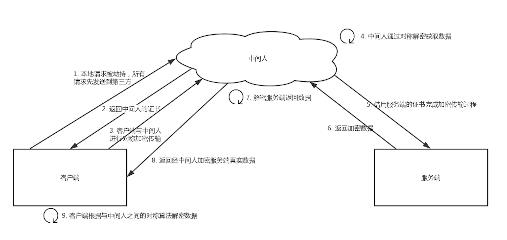

回到我们具体的应用场景，其实就是要在 PC 设备和连接代理的移动设备上，都装上并信任 whistle 提供的 CA 证书即可。

解释完原理，安装和信任证书的过程就很自然了，详见[官方指南](https://wproxy.org/whistle/webui/https.html#%E5%AE%89%E8%A3%85%E6%A0%B9%E8%AF%81%E4%B9%A6)

完成证书的安装后，在 whistle 代理配置面板（`http://127.0.0.1:8899`）中开启这两个设置即可

> HTTPS > 勾选 `Capture TUNNEL CONNECTS` 和 `Enable HTTP/2`

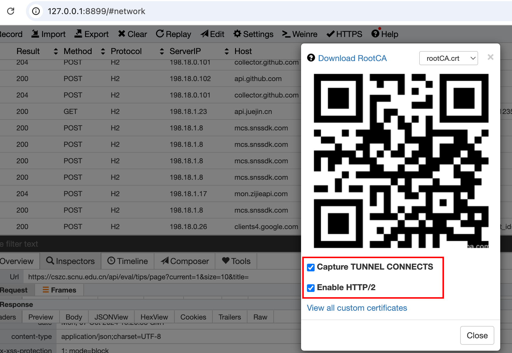

这样一来，但凡信任了 whistle 证书的设备，无论是 PC 还是 Android 还是 iOS，他们产生的 HTTPS 流量就都能被 whistle 代理服务器解包了。

## 小结

本文档简单介绍了前后端分离式开发中的 HTTP 通信和 HTTP 代理的基本原理，并介绍了一种 Web 调试代理工具 `whistle` 及其基本使用方法。

<style module>
  .row {
    width: 100%;
    flex-shrink: 0;
    display: flex;
    align-items: center;
    overflow: hidden;

    img {
      min-width: 0;
      flex: 1 0;
      height: auto;
    }
  }
</style>
